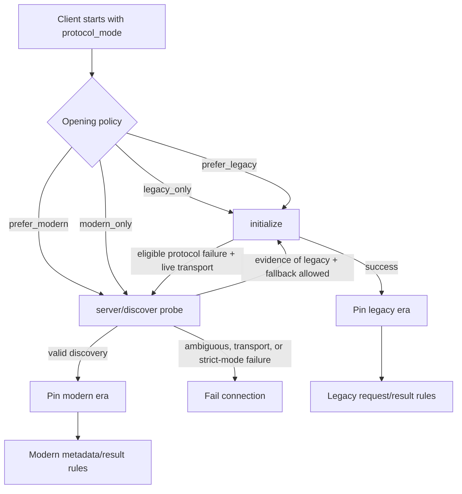

# ExMCP Architecture Guide

ExMCP is organized around protocol boundaries: clients, servers, transports,
HTTP Plug integration, ACP, authorization, and internal protocol helpers. Public
APIs stay small; cross-cutting work is kept at transport or Plug boundaries.

## Public Layers

### MCP Client

`ExMCP.Client` owns the client process, protocol-era establishment, request
IDs, server capability state, retries, and request/response formatting.

Client operation modules under `lib/ex_mcp/client/operations/` keep tool,
resource, and prompt calls focused while `ExMCP.Client.ConnectionManager`
normalizes transport startup.

### MCP Server

Server implementations use `ExMCP.Server.Handler`. Most applications should add
`ExMCP.Server.DSL` for declarative tools, resources, and prompts:

```elixir
defmodule MyServer do
  use ExMCP.Server.Handler
  use ExMCP.Server.DSL

  tool "echo", "Echo input" do
    param :message, :string, required: true

    run fn %{message: message}, state ->
      {:ok, %{content: [%{type: "text", text: message}]}, state}
    end
  end
end
```

`ExMCP.Server.HandlerServer` is the transport-aware process for in-memory and
BEAM-local handler execution. HTTP and stdio servers are started through
`ExMCP.Server.Transport` or the DSL-generated `start_link/1`.

### Transports

Transport modules implement `ExMCP.Transport`:

- `ExMCP.Transport.Stdio` for newline-delimited JSON-RPC over subprocess stdio.
- `ExMCP.Transport.HTTP` for legacy and modern Streamable HTTP. Legacy
  revisions may use a standalone GET SSE stream; modern SSE belongs to its
  originating POST.
- `ExMCP.Transport.Local` for BEAM-local MCP maps/lists passed as Elixir terms.
- `ExMCP.Transport.Test` for in-memory tests.

BEAM-local MCP is selected with `transport: :beam` and requires a server PID:

```elixir
{:ok, server} = MyServer.start_link(transport: :beam)  # or HandlerServer.start_link(handler: MyHandler, ...)
{:ok, client} = ExMCP.Client.start_link(transport: :beam, server: server)
```

The removed `:native` alias and direct dispatcher API are not part of the 1.0
public architecture.

### HTTP Plug

`ExMCP.HttpPlug` is the HTTP server boundary. Request parsing, session
resolution, CORS/origin handling, response shaping, and SSE handling are split
under `lib/ex_mcp/http_plug/`.

Use normal Phoenix/Plug composition for HTTP edge concerns:

```elixir
pipeline :mcp do
  plug ExMCP.Plugs.DnsRebinding
  plug MyApp.AuthenticateMCP
end

scope "/mcp" do
  pipe_through :mcp

  forward "/", ExMCP.HttpPlug,
    handler: MyApp.MCPServer,
    server_info: %{name: "my-app", version: "1.0.0"}
end
```

### ACP

ACP modules live under `lib/ex_mcp/acp/`. `ExMCP.ACP.Client` controls ACP
agents, `ExMCP.ACP.Agent` exposes native Elixir ACP agents, and adapter modules
bridge external CLIs such as Claude Code, Codex, and Pi.

ACP pooling is intentionally left to consumers. ExMCP provides the protocol,
transport, adapter, and native-agent building blocks.

## Protocol Era Model

ExMCP treats MCP 2025-11-25 and earlier as the **legacy era** and MCP
2026-07-28 as the **modern era**. This is an architectural boundary, not just a
version comparison: handshake, metadata, result envelopes, notifications, and
HTTP state all change together. A connection is established in one era and is
never allowed to mix wire shapes afterward.



The four modes are intentionally policies rather than protocol versions:

| Mode | Enabled eras | Client opens with | Automatic fallback |
|---|---|---|---|
| `:legacy_only` | Legacy | `initialize` | Never |
| `:prefer_legacy` | Both | `initialize` | To modern only after an eligible protocol failure on a live transport |
| `:prefer_modern` | Both | `server/discover` | To legacy only with positive compatibility evidence on a live transport |
| `:modern_only` | Modern | `server/discover` | Never |

On the server, both `:prefer_legacy` and `:prefer_modern` accept either era;
the preference controls advertised version ordering. HandlerServer and stdio
connections pin on a valid modern request or legacy `initialize`. HTTP remains
stateless in the modern era, so `ExMCP.Server.RequestContext` derives and
validates the era on each request instead.

### Era responsibilities

- ExMCP.Internal.VersionRegistry is the source of truth for known revisions,
  their era, enabled versions, and preference order. The zero-arity legacy
  helpers deliberately retain rc.5 behavior during the RC soak.
- `ExMCP.Client.ConnectionManager` applies the selected policy.
  `ExMCP.Client.EraProbe` owns the bounded, side-effect-free
  `server/discover` probe.
- `ExMCP.Client.EraCache` keys observations by transport identity. Modern
  observations do not expire and cannot be replaced by automatic downgrade;
  legacy observations expire so an upgraded peer is eventually probed again.
- `ExMCP.Server.RequestContext` separates modern `_meta` from application
  parameters, validates the configured mode and method availability, and
  exposes a single context to dispatch.
- `ExMCP.Protocol.ResultEnvelope` enforces modern `resultType` while preserving
  the legacy result shape. MRTR continuation state, cache hints, subscriptions,
  and modern Tasks remain protocol-layer concerns rather than transport state.
- Transports implement era-specific framing only. When HTTP settles modern it
  discards legacy session state and disables the standalone GET stream.

This separation prevents a failed modern probe from becoming an unsafe silent
downgrade. Fallback requires both a recognized compatibility signal and a
still-usable transport. A cached modern peer failing its next probe is surfaced
as an error until the operator clears that observation or changes policy.

## Internal Functional Cores

Pure transformation and validation logic is kept separate from process and I/O
boundaries:

- Internal protocol and version modules handle message construction, parsing,
  and version rules.
- The message processor modules provide a Plug-like processing pipeline for
  server request dispatch.
- `ExMCP.Content.*` modules normalize content, sanitize inputs, and validate
  schema-related data.
- ACP mapper/protocol/session modules keep adapter-specific decoding separate
  from subprocess ports.

This structure keeps side effects at the edges: GenServers, Ports, HTTP
requests, Plug connections, filesystem-backed session stores, and telemetry.

## Resilience And Pipelines

ExMCP currently has three pipeline-style boundaries:

- HTTP server requests: normal Plug/Phoenix pipelines around `ExMCP.HttpPlug`.
- Server message processing: `ExMCP.MessageProcessor.run/2` for internal
  Plug-like request processing.
- Transport reliability: `ExMCP.Transport.ReliabilityWrapper`, client
  `retry_policy`, and `ExMCP.Reliability.*` components.

HTTP client connection handling is transport-owned today. If ExMCP later adds a
public client middleware API, it should wrap request construction and transport
send/receive at the `ExMCP.Client` boundary rather than inside HTTP-specific
code, so stdio, HTTP, and BEAM-local can share the same cross-cutting behavior.

## Module Map

```text
lib/ex_mcp/
  acp/                 ACP protocol, client, native agent, adapters
  authorization/       OAuth 2.1 and auth provider flows
  client/              Client operations, handlers, state, connection setup
  content/             Content builders, validation, sanitization
  http_plug/           HTTP Plug functional core and SSE handling
  internal/            Private protocol, era/version, map, and security helpers
  message_processor/   Plug-like MCP request processing
  plugs/               Reusable Plug security/auth components
  protocol/            Public protocol utility modules
  reliability/         Retry, circuit breaker, health check supervisor
  server/              Handler behavior, DSL, transport startup
  transport/           Stdio, HTTP, BEAM-local, test transports
```

## Testing Architecture

The test suite covers unit, integration, interop, conformance, security, and
transport behavior. `ExMCP.Transport.Test` and `transport: :beam` keep local
server/client tests fast without starting subprocesses or network listeners.

External conformance scripts live in `scripts/` and should be run for each
supported MCP spec version before release:

```bash
./scripts/conformance.sh              # latest stable suite
./scripts/conformance.sh all-versions # all negotiated legacy MCP versions
./scripts/conformance.sh draft-alpha  # 2026-07-28 harness during the RC soak
mix mcp.sync_spec --version 2026-07-28 --force  # refresh local docs/mcp-specs
```

### Protocol version alignment

| Protocol era | Revisions | ExMCP 1.0 RC support |
|---|---|---|
| MCP legacy | `2024-11-05`, `2025-03-26`, `2025-06-18`, `2025-11-25` | Enabled by `:legacy_only` and both preference modes |
| MCP modern | `2026-07-28` | Implemented; enabled by `:modern_only` and both preference modes |
| ACP | major `1` | `protocolVersion: 1` |

## Design Rules

- Prefer `ExMCP.Server.Handler` plus `ExMCP.Server.DSL` for servers.
- Select an explicit protocol mode in deployments and tests; never infer an
  era solely from a method name after a connection has pinned.
- Keep compatibility fallback in `ExMCP.Client.ConnectionManager` and
  `ExMCP.Client.EraProbe`; application operations must not implement their own
  modern-to-legacy retry.
- Use `transport: :beam` for local BEAM MCP, not a separate service dispatcher.
- Put HTTP authorization, origin, and request-signing checks in Plug pipelines.
- Put transport failure handling in client retry/reliability options.
- Keep pure protocol transformations in functional modules and side effects in
  GenServer, Port, Plug, or filesystem boundaries.
