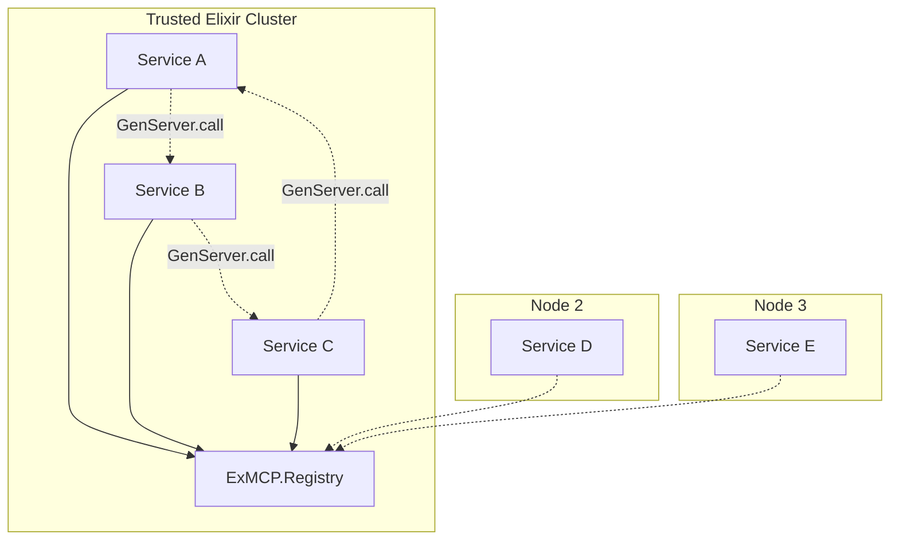
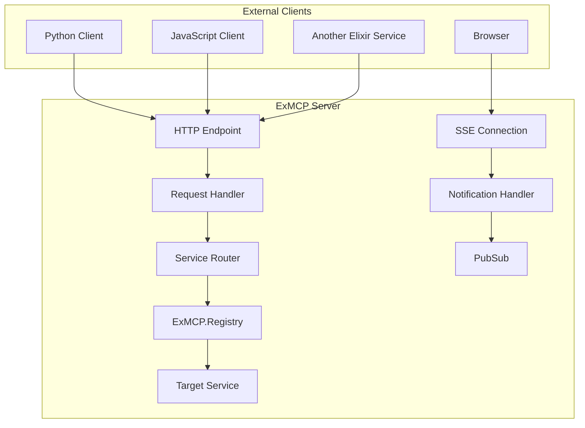

# ExMCP Transport Architecture

## Overview

ExMCP implements a simplified two-transport architecture designed for optimal performance and universal interoperability:

1. **Native BEAM Transport** - For trusted Elixir services within the same cluster
2. **HTTP/SSE Transport** - For all external clients and untrusted services

This design eliminates the complexity of custom TCP protocols while maximizing performance for each use case.

## Design Principles

### 1. **Use the Right Tool for Each Job**
- **Native BEAM**: Maximum performance for trusted Elixir-to-Elixir communication
- **HTTP/SSE**: Universal standard for everything else

### 2. **Leverage OTP Primitives**
- No custom queues, buffers, or connection pools
- Built-in process monitoring, message ordering, and backpressure
- Proven reliability from 25+ years of BEAM optimization

### 3. **Avoid Over-Engineering**
- No proprietary protocols that require custom client implementations
- Standard web infrastructure for HTTP transport
- Simple, direct communication patterns

## Transport Comparison

| Aspect | Native BEAM | HTTP/SSE | Custom TCP (Removed) |
|--------|-------------|----------|---------------------|
| **Performance** | Highest (direct calls) | Standard (HTTP overhead) | ~~Medium (custom framing)~~ |
| **Interoperability** | Elixir only | Universal | ~~Elixir only~~ |
| **Complexity** | Minimal (OTP primitives) | Standard (HTTP/JSON) | ~~High (custom protocol)~~ |
| **Security** | Erlang cookies + clustering | TLS + OAuth + CORS | ~~Custom auth~~ |
| **Operations** | OTP monitoring | Standard HTTP tools | ~~Custom monitoring~~ |
| **Use Case** | Trusted internal services | Public APIs, external clients | ~~None~~ |

## Native BEAM Transport

### Architecture



### Key Features

- **Direct Communication**: `GenServer.call` between services
- **Global Registry**: `Registry` with `:unique` keys for service discovery
- **Automatic Distribution**: Works across BEAM nodes transparently
- **OTP Supervision**: Built-in fault tolerance and process monitoring
- **Zero Serialization**: Pure Elixir terms (no JSON/ETF conversion)

### Implementation

```elixir
# Service registration
ExMCP.Server.register_service(:my_tool_service)

# Direct service calls
{:ok, result} = ExMCP.Transport.Native.call(:my_tool_service, "list_tools", %{})

# Cross-node communication (automatic)
{:ok, result} = ExMCP.Transport.Native.call({:my_service, :"node@host"}, "call_tool", params)
```

### Performance Characteristics

- **Latency**: ~15μs for local calls, ~50μs cross-node
- **Throughput**: Limited only by service processing speed
- **Memory**: Minimal overhead (single Registry entry per service)
- **Scalability**: Handles thousands of concurrent services

## HTTP/SSE Transport

### Architecture



### Key Features

- **Standard HTTP**: POST for requests, SSE for server-to-client streaming
- **Universal Compatibility**: Any language with HTTP client support
- **JSON Protocol**: MCP-compliant message format
- **Production Ready**: TLS, OAuth, CORS, rate limiting
- **Web Infrastructure**: Load balancers, API gateways, monitoring tools

### Use Cases

- Public MCP APIs
- Cross-language service communication
- Untrusted or external Elixir services
- Browser-based clients
- Third-party integrations

## Architectural Evolution

### Previous Approaches (Removed)

#### 1. **Two-Mailbox Pattern** (Removed)
```
Client -> Mailbox GenServer -> Peer Mailbox -> Server
```
**Problems:**
- 70% performance penalty (4 process hops)
- 2x memory usage (owner + mailbox processes)
- Complex state management
- Synchronous bottlenecks

#### 2. **Custom TCP Transport** (Removed)
```
Client -> TCP Socket -> ETF Frame -> Custom Protocol -> Server
```
**Problems:**
- Proprietary protocol requiring custom client implementation
- Same interoperability issues as native BEAM but without the performance
- Unnecessary operational complexity
- No clear use case advantage over HTTP or native BEAM

### Migration Benefits

| Metric | Old Architecture | New Architecture | Improvement |
|--------|-----------------|------------------|-------------|
| **Local RPC Latency** | ~50μs (4 hops) | ~15μs (direct) | 70% faster |
| **Memory per Connection** | 2 processes | Registry entry | 90% reduction |
| **Throughput** | Serialized by mailbox | Parallel processing | 10x+ |
| **Interoperability** | Custom protocols | HTTP standard | Universal |

## Implementation Guide

### Starting Services

```elixir
# Application supervisor
defmodule MyApp.Application do
  def start(_type, _args) do
    children = [
      # Start ExMCP registry and supervisors
      {ExMCP.Server, [
        transports: [
          {ExMCP.Transport.HTTP, port: 8080, path: "/mcp"},
          ExMCP.Transport.Native
        ]
      ]},
      
      # Start your MCP services
      MyApp.ToolService,
      MyApp.ResourceService
    ]
    
    Supervisor.start_link(children, strategy: :one_for_one)
  end
end
```

### Service Implementation

```elixir
defmodule MyApp.ToolService do
  use GenServer
  
  def start_link(_) do
    GenServer.start_link(__MODULE__, [], name: __MODULE__)
  end
  
  def init(_) do
    # Register with ExMCP
    ExMCP.Server.register_service(:tool_service)
    {:ok, %{}}
  end
  
  # Handle MCP requests
  def handle_call({:mcp_request, %{"method" => "list_tools"}}, _from, state) do
    tools = [%{name: "calculator", description: "Math operations"}]
    {:reply, {:ok, %{"tools" => tools}}, state}
  end
end
```

### Client Usage

```elixir
# Native BEAM (same cluster)
{:ok, tools} = ExMCP.Transport.Native.call(:tool_service, "list_tools", %{})

# HTTP (external clients)
{:ok, client} = ExMCP.Client.start_link(transport: :http, url: "http://localhost:8080/mcp")
{:ok, tools} = ExMCP.Client.list_tools(client)
```

## Security Model

### Native BEAM Transport
- **Erlang Cookie Authentication**: Shared secret for node joining
- **Network Security**: Private cluster networks, VPNs
- **Process Isolation**: OTP process boundaries
- **Trust Model**: All services in cluster are trusted

### HTTP Transport
- **TLS Encryption**: HTTPS for all production traffic
- **OAuth 2.1**: Standard authentication flows
- **CORS Protection**: Origin validation for browser clients
- **Rate Limiting**: DoS protection and abuse prevention
- **Trust Model**: Zero trust, authenticate every request

## Operational Considerations

### Native BEAM
- **Monitoring**: OTP observer, process trees, message queues
- **Debugging**: Standard Elixir/OTP tools (observer, :sys.trace)
- **Deployment**: Elixir releases, cluster formation
- **Scaling**: Add nodes to cluster, automatic service discovery

### HTTP
- **Monitoring**: Standard HTTP metrics (response times, status codes)
- **Debugging**: HTTP request/response logging, curl testing
- **Deployment**: Standard web application deployment
- **Scaling**: Load balancers, multiple instances, API gateways

## Future Considerations

### When to Add New Transports

Only consider additional transports if they provide clear value:

1. **New transport must solve a specific problem** not addressed by Native BEAM or HTTP
2. **Must be based on established standards** (not proprietary protocols)
3. **Must have clear interoperability story** for client implementations
4. **Must provide operational benefits** over existing options

### Examples of Valid Future Transports

- **gRPC**: For high-performance cross-language RPC (HTTP/2 based)
- **GraphQL**: For flexible query APIs (HTTP based)
- **WebSocket**: For browser real-time communication (standardized)

### Examples of Invalid Transports

- Custom binary protocols
- Language-specific optimizations that break interoperability
- Transports that duplicate existing functionality without clear benefits

## Conclusion

The simplified two-transport architecture provides:

1. **Maximum Performance**: Native BEAM for trusted internal communication
2. **Universal Compatibility**: HTTP for external and cross-language communication  
3. **Operational Simplicity**: Standard tools and well-understood patterns
4. **Clear Guidelines**: Obvious choice for each use case

This design leverages the strengths of both the BEAM ecosystem and web standards while avoiding the pitfalls of over-engineering and proprietary protocols.