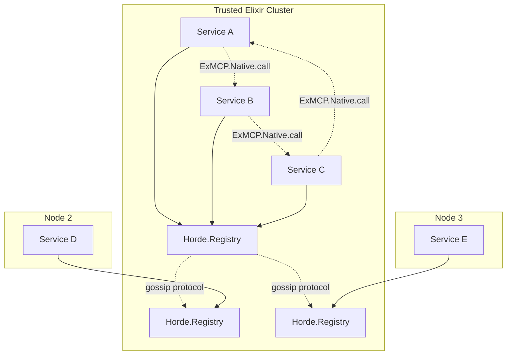
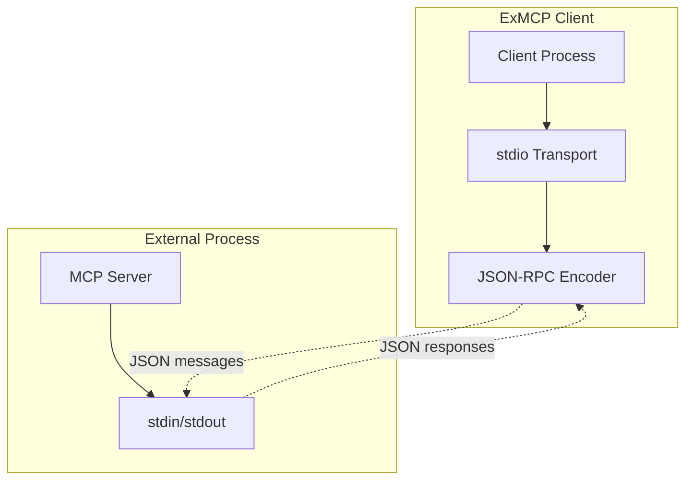
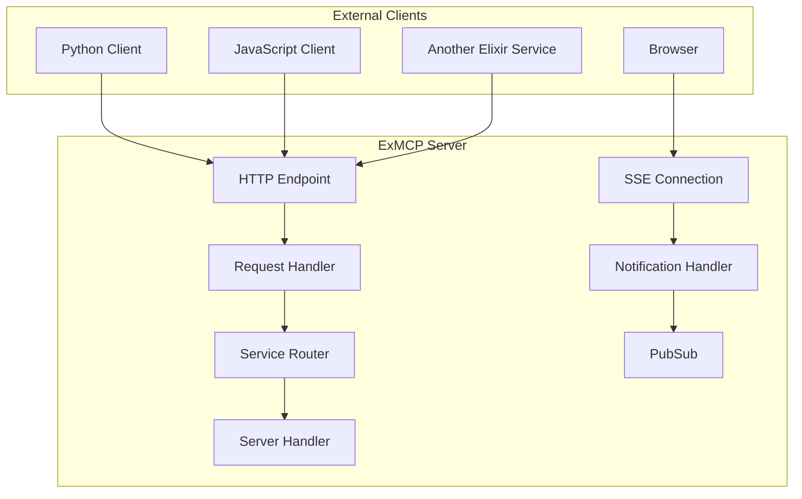

# ExMCP Transport Architecture

## Overview

ExMCP implements a simplified two-pattern architecture designed for optimal performance and universal interoperability:

1. **Native BEAM Service Dispatcher** - For trusted Elixir services within the same cluster
2. **Traditional MCP Transports** - For external clients and MCP protocol compliance (stdio, HTTP/SSE)

This design eliminates the complexity of custom TCP protocols while maximizing performance for each use case.

## Design Principles

### 1. **Use the Right Tool for Each Job**
- **Native BEAM Service Dispatcher**: Maximum performance for trusted Elixir-to-Elixir communication
- **Traditional MCP Transports**: Universal standard for external clients and MCP compliance

### 2. **Leverage OTP Primitives**
- No custom queues, buffers, or connection pools
- Built-in process monitoring, message ordering, and backpressure
- Proven reliability from 25+ years of BEAM optimization

### 3. **Avoid Over-Engineering**
- No proprietary protocols that require custom client implementations
- Standard web infrastructure for HTTP transport
- Simple, direct communication patterns

## Architecture Comparison

| Aspect | Native BEAM Dispatcher | Traditional MCP | Custom TCP (Removed) |
|--------|----------------------|----------------|---------------------|
| **Performance** | Highest (~15μs direct calls) | Standard (~1-5ms HTTP) | ~~Medium (custom framing)~~ |
| **Interoperability** | Elixir only | Universal | ~~Elixir only~~ |
| **Complexity** | Minimal (Horde.Registry) | Standard (HTTP/JSON) | ~~High (custom protocol)~~ |
| **Security** | Erlang cookies + clustering | TLS + OAuth + CORS | ~~Custom auth~~ |
| **Operations** | OTP monitoring | Standard HTTP tools | ~~Custom monitoring~~ |
| **MCP Compliance** | ExMCP extension | Full MCP protocol | ~~Custom~~ |
| **Discovery** | Horde.Registry gossip | Manual configuration | ~~Custom~~ |
| **Use Case** | Trusted internal services | External clients, AI models | ~~None~~ |

## Native BEAM Service Dispatcher

### Architecture



### Key Features

- **Direct Communication**: `GenServer.call` via `ExMCP.Native`
- **Horde.Registry**: Distributed service discovery with gossip protocol
- **Automatic Distribution**: Works across BEAM nodes transparently
- **OTP Supervision**: Built-in fault tolerance and process monitoring
- **Zero Serialization**: Pure Elixir terms (no JSON/ETF conversion)
- **Service Macro**: `use ExMCP.Service` for automatic lifecycle management

### Implementation

```elixir
# Service definition with automatic registration
defmodule MyToolService do
  use ExMCP.Service, name: :my_tools
  
  @impl true
  def handle_mcp_request("list_tools", _params, state) do
    tools = [%{"name" => "ping", "description" => "Test tool"}]
    {:ok, %{"tools" => tools}, state}
  end
end

# Direct service calls
{:ok, result} = ExMCP.Native.call(:my_tools, "list_tools", %{})

# Cross-node communication (automatic via Horde)
{:ok, result} = ExMCP.Native.call({:my_service, :"node@host"}, "tools/call", params)
```

### Performance Characteristics

- **Latency**: ~15μs for local calls, ~50μs cross-node
- **Throughput**: Limited only by service processing speed
- **Memory**: Minimal overhead (single Registry entry per service)
- **Scalability**: Handles thousands of concurrent services

## Traditional MCP Transports

### stdio Transport Architecture



### HTTP/SSE Transport Architecture



### Key Features

- **stdio Transport**: Process communication via standard I/O (official MCP)
- **HTTP/SSE Transport**: POST for requests, SSE for server-to-client streaming (official MCP)
- **Universal Compatibility**: Any language with transport support
- **JSON-RPC Protocol**: Full MCP specification compliance
- **Production Ready**: TLS, OAuth, CORS, rate limiting
- **Web Infrastructure**: Load balancers, API gateways, monitoring tools

### Use Cases

- External AI model integration
- Cross-language service communication
- Public MCP APIs
- Browser-based clients
- Third-party MCP tool providers
- Untrusted or external Elixir services

## Architectural Evolution

### Previous Approaches (Removed)

#### 1. **Two-Mailbox Pattern** (Removed)
```
Client -> Mailbox GenServer -> Peer Mailbox -> Server
```
**Problems:**
- 70% performance penalty (4 process hops)
- 2x memory usage (owner + mailbox processes)
- Complex state management
- Synchronous bottlenecks

#### 2. **Custom TCP Transport** (Removed)
```
Client -> TCP Socket -> ETF Frame -> Custom Protocol -> Server
```
**Problems:**
- Proprietary protocol requiring custom client implementation
- Same interoperability issues as native BEAM but without the performance
- Unnecessary operational complexity
- No clear use case advantage over HTTP or native BEAM

### Migration Benefits

| Metric | Old Architecture | New Architecture | Improvement |
|--------|-----------------|------------------|-------------|
| **Local RPC Latency** | ~50μs (4 hops) | ~15μs (direct) | 70% faster |
| **Memory per Connection** | 2 processes | Registry entry | 90% reduction |
| **Throughput** | Serialized by mailbox | Parallel processing | 10x+ |
| **Interoperability** | Custom protocols | HTTP standard | Universal |

## Implementation Guide

### Starting Traditional MCP Servers

```elixir
# Application supervisor
defmodule MyApp.Application do
  def start(_type, _args) do
    children = [
      # Traditional MCP server with stdio transport
      {ExMCP.Server, [
        handler: MyApp.MCPHandler,
        transport: :stdio
      ]},
      
      # HTTP server for external clients
      {ExMCP.Server, [
        handler: MyApp.MCPHandler,
        transport: :http,
        port: 8080,
        path: "/mcp"
      ]},
      
      # Native BEAM services
      MyApp.ToolService,
      MyApp.ResourceService
    ]
    
    Supervisor.start_link(children, strategy: :one_for_one)
  end
end
```

### Traditional MCP Server Implementation

```elixir
defmodule MyApp.MCPHandler do
  use ExMCP.Server.Handler
  
  @impl true
  def init(_args), do: {:ok, %{}}
  
  @impl true
  def handle_initialize(_params, state) do
    {:ok, %{
      protocolVersion: "2025-03-26",
      serverInfo: %{name: "my-server", version: "1.0.0"},
      capabilities: %{tools: %{}}
    }, state}
  end
  
  @impl true
  def handle_list_tools(_cursor, state) do
    tools = [%{name: "calculator", description: "Math operations"}]
    {:ok, tools, nil, state}
  end
end
```

### Native BEAM Service Implementation

```elixir
defmodule MyApp.ToolService do
  use ExMCP.Service, name: :tool_service
  
  @impl true
  def handle_mcp_request("list_tools", _params, state) do
    tools = [%{"name" => "calculator", "description" => "Math operations"}]
    {:ok, %{"tools" => tools}, state}
  end
end
```

### Client Usage

```elixir
# Native BEAM (same cluster) - Ultra-fast
{:ok, tools} = ExMCP.Native.call(:tool_service, "list_tools", %{})

# Traditional MCP clients
{:ok, stdio_client} = ExMCP.Client.start_link(transport: :stdio, command: ["mcp-server"])
{:ok, http_client} = ExMCP.Client.start_link(transport: :http, url: "http://localhost:8080/mcp")
{:ok, tools} = ExMCP.Client.list_tools(http_client)
```

## Security Model

### Native BEAM Service Dispatcher
- **Erlang Cookie Authentication**: Shared secret for node joining
- **Network Security**: Private cluster networks, VPNs
- **Process Isolation**: OTP process boundaries
- **Horde Security**: Distributed consensus and conflict resolution
- **Trust Model**: All services in cluster are trusted

### Traditional MCP Transports
- **TLS Encryption**: HTTPS for all production traffic
- **OAuth 2.1**: Standard authentication flows
- **CORS Protection**: Origin validation for browser clients
- **Rate Limiting**: DoS protection and abuse prevention
- **Trust Model**: Zero trust, authenticate every request
- **stdio Security**: Process isolation and controlled execution

## Operational Considerations

### Native BEAM Service Dispatcher
- **Monitoring**: OTP observer, Horde cluster status, service registry
- **Debugging**: Standard Elixir/OTP tools (observer, :sys.trace)
- **Deployment**: Elixir releases, cluster formation
- **Scaling**: Add nodes to cluster, automatic service discovery via Horde
- **Performance**: `:timer.tc/1` for call latency measurement

### Traditional MCP Transports
- **Monitoring**: Standard HTTP metrics (response times, status codes)
- **Debugging**: HTTP request/response logging, curl testing, stdio logs
- **Deployment**: Standard web application deployment
- **Scaling**: Load balancers, multiple instances, API gateways
- **MCP Compliance**: Protocol validation and conformance testing

## Future Considerations

### When to Add New Transports

Only consider additional transports if they provide clear value:

1. **New transport must solve a specific problem** not addressed by Native BEAM or HTTP
2. **Must be based on established standards** (not proprietary protocols)
3. **Must have clear interoperability story** for client implementations
4. **Must provide operational benefits** over existing options

### Examples of Valid Future Transports

- **gRPC**: For high-performance cross-language RPC (HTTP/2 based)
- **GraphQL**: For flexible query APIs (HTTP based)
- **Message Queues**: For async communication (AMQP, Kafka)
- **Unix Domain Sockets**: For high-performance local IPC

### Examples of Invalid Transports

- Custom binary protocols
- Language-specific optimizations that break interoperability
- Transports that duplicate existing functionality without clear benefits

## Conclusion

The simplified two-pattern architecture provides:

1. **Maximum Performance**: Native BEAM Service Dispatcher for trusted internal communication (~15μs)
2. **Universal Compatibility**: Traditional MCP transports for external and cross-language communication
3. **Protocol Compliance**: Full MCP specification support for interoperability
4. **Operational Simplicity**: Standard tools and well-understood patterns
5. **Clear Guidelines**: Obvious choice for each use case

This design leverages the strengths of both the BEAM ecosystem and web standards while avoiding the pitfalls of over-engineering and proprietary protocols.